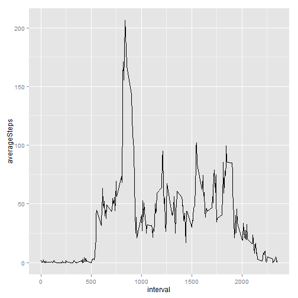
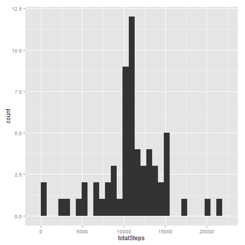
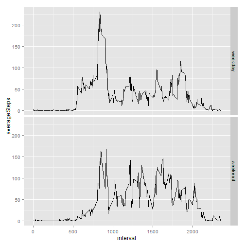

Set your working directory (varies by individual.  This sets mine.)


```r
setwd("~/Kent/DataScienceSeries/ReproducibleResearch")
```

Read in the data from the activity tracker.  This assumes the data file  
activity.csv is in a "data" subdirectory of the current working directory. 


```r
trackerdf <- read.csv("./data/activity.csv")
```
Add a column that converts the character string date to POSIX so we can use some date functions later.


```r
trackerdf$pos_date <-strptime(trackerdf$date,"%Y-%m-%d")
```

Calculate the total number of steps taken per day and  store in a dataframe with the activity date.


```r
StepsByDate <- data.frame(unique(trackerdf$date))
StepsByDate$totalSteps <- tapply(trackerdf$steps,trackerdf$date,sum)
names(StepsByDate) <- c("date","totalSteps")
```

Load the ggplot2 library and plot a histogram of the total number of steps per day.


```r
library(ggplot2)
qplot(totalSteps,data=StepsByDate,geom="histogram")
```

 

Calculate and report the mean of the total number of steps per day


```r
meanSteps <- mean(StepsByDate$totalSteps,na.rm=T)
cat("Mean steps per day with original data is",meanSteps)
```

```
## Mean steps per day with original data is 10766.19
```

Calculate and report the median of the total number of steps per day


```r
medianSteps <- median(StepsByDate$totalSteps,na.rm=T)
cat("Median steps per day with original data is",medianSteps)
```

```
## Median steps per day with original data is 10765
```

Make a time series plot with the 5 minute interval as the x axis
and the average number of steps taken, averaged across all days

First calculate the average number of steps taken during each interval...


```r
StepsByInterval <- data.frame(unique(trackerdf$interval))
StepsByInterval$averageSteps <- tapply(trackerdf$steps,trackerdf$interval,mean,na.rm=T)
names(StepsByInterval) <- c("interval","averageSteps")
```
Now, make the plot.


```r
qplot(interval,averageSteps,data=StepsByInterval,geom="line")
```

 

Determine Which 5-minute interval, on average across all the days in the dataset,
contains the maximum number of steps.


```r
maxSteps <- StepsByInterval[which.max(StepsByInterval$averageSteps),]
cat("The interval with the maximum average steps (",maxSteps$averageSteps,") is the interval",maxSteps$interval)
```

```
## The interval with the maximum average steps ( 206.1698 ) is the interval 835
```

Calculate and report the total number of missing values in the dataset 


```r
naCount <- nrow(trackerdf[is.na(trackerdf),])
cat("There are",naCount,"missing values in the dataset")
```

```
## There are 2304 missing values in the dataset
```

Create a new dataset that is equal to the original dataset but with the missing data filled in.
The method I used to impute a value was the average steps for the interval.

Step 1 - Merge the activity dataframe with the summary of steps by activity date we previously created using interval as the shared column.


```r
trackerdf_imputed <- merge(trackerdf,StepsByInterval)
```

Step 2 - Replace the NA with the average for the interval:

-  Create an index of the NA values...


```r
naIndex <- is.na(trackerdf_imputed$steps)
```
-  Use the index to replace the NA's with average number of steps for the interval 


```r
trackerdf_imputed[naIndex,"steps"] <- trackerdf_imputed[naIndex,"averageSteps"] 
```

Calculate the total number of steps taken per day and store in a dataframe with date


```r
StepsByDate_no_NA <- data.frame(unique(trackerdf_imputed$date))
StepsByDate_no_NA$totalSteps <- tapply(trackerdf_imputed$steps,trackerdf_imputed$date,sum)
names(StepsByDate_no_NA) <- c("date","totalSteps")
```

Plot a new histogram of the total number of steps taken each day with the imputed data


```r
qplot(totalSteps,data=StepsByDate_no_NA,geom="histogram")
```

 

Calculate and report the mean of the total number of steps per day


```r
meanSteps_no_NA <- mean(StepsByDate_no_NA$totalSteps)
cat("Mean steps per day with imputed data is",meanSteps_no_NA)
```

```
## Mean steps per day with imputed data is 10766.19
```

Calculate and report the median of the total number of steps per day


```r
medianSteps_no_NA <- median(StepsByDate_no_NA$totalSteps)
cat("Median steps per day with imputed data is",medianSteps_no_NA)
```

```
## Median steps per day with imputed data is 10766.19
```

Compare the mean and median calculated with missing values to those calculated with imputed values. What impact did the imputed values have on the estimates of total daily number of steps?


```r
cat("Difference between the two means is",meanSteps_no_NA-meanSteps)
```

```
## Difference between the two means is 0
```

```r
cat("Difference between the two medians is",medianSteps_no_NA-medianSteps)
```

```
## Difference between the two medians is 1.188679
```

```r
cat("The imputed values had no impact on the mean number of steps but increased the median.")
```

```
## The imputed values had no impact on the mean number of steps but increased the median.
```
It is worth mentioning that the mean and the median are now the same out to 10 decimal places!  This startling result can be explained by pointing to the fact that the NA values all came from eight dates when the activity tracker was not used and therefore all the intervals for those dates was NA. Since I used the average for the interval across all dates for my imputed values, the total steps for those dates was the mean for all dates.  With eight of the 61 dates all having total steps equal to the mean for all dates, it is really no surprise when the median is exactly the same as the mean.

Use the function weekdays() to create a new factor variable in the data set with two levels, "weekday" and "weekend" indicating whether a given date is a weekday or weekend day.   


```r
trackerdf_imputed$weekPart <- ifelse(weekdays(trackerdf_imputed$pos_date)=="Saturday"|weekdays(trackerdf_imputed$pos_date)=="Sunday","weekend","weekday")
```

Make a panel plot containing a time series plot of the 5 minute interval (x axis)
and the average number of steps taken, averaged across all weekday days or weekend days (y axis)

First calculate the average number of steps taken during each interval during the weekend...


```r
WeekendStepsByInterval <- data.frame(unique(trackerdf_imputed$interval[trackerdf_imputed$weekPart=="weekend"]))
WeekendStepsByInterval$averageSteps <- tapply(trackerdf_imputed$steps[trackerdf_imputed$weekPart=="weekend"],trackerdf_imputed$interval[trackerdf_imputed$weekPart=="weekend"],mean)
WeekendStepsByInterval$weekPart <- "weekend"
names(WeekendStepsByInterval) <- c("interval","averageSteps","weekPart")
```

Next calculate the average number of steps taken during the week...


```r
WeekdayStepsByInterval <- data.frame(unique(trackerdf_imputed$interval[trackerdf_imputed$weekPart=="weekday"]))
WeekdayStepsByInterval$averageSteps <- tapply(trackerdf_imputed$steps[trackerdf_imputed$weekPart=="weekday"],trackerdf_imputed$interval[trackerdf_imputed$weekPart=="weekday"],mean)
WeekdayStepsByInterval$weekPart <- "weekday"
names(WeekdayStepsByInterval) <- c("interval","averageSteps","weekPart")
```

Combine the two data frames using rbind for plotting ...

```r
StepsByInterval_weekPart <- rbind(WeekendStepsByInterval,WeekdayStepsByInterval)
```

Now, make the plot.

```r
qplot(interval,averageSteps,data=StepsByInterval_weekPart,facets=weekPart~.,geom="line")
```

 


